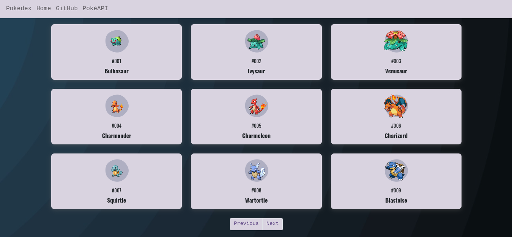

## This site was built with:

<a href="https://www.w3.org/TR/CSS/#css" target="_blank" rel="noreferrer"> </a>

## A simple pokedex 

 

## Getting Started

1. Download the repository files from the download section or clone this project: https://github.com/Agslz/pokedex-app
2. Import it in VScode or any other text editor.
3. Have fun 🚀.

